Exercise: Working with SAP UI Data Protection

SAP TechEd Version 2023-11

<u>Table of Contents</u>
**1. Table of Contents [2](#_Toc148094853)**

**2. Introduction and Overview [3](#introduction-and-overview)**

A. Overview and business scenario [3](#overview-and-business-scenario)

B. Introduction to UIDP Masking [3](#introduction-to-uidp-masking)

C. Quick live product demo [4](#quick-live-product-demo)

**3. Training: Time to get busy! [7](#training-time-to-get-busy)**

A. Overview UIDP Masking Configuration [7](#overview-uidp-masking-configuration)

B. Logon to demo/hands-on systems [7](#logon-to-demohands-on-systems)

**4. Optional warm-up: UI Data Protection Logging [11](#optional-warm-up-ui-data-protection-logging)**

A. Introduction: what is UI Data Protection Logging? [12](#introduction-what-is-ui-data-protection-logging)

B. Setup/Configuration steps (“minimal viable” scenario) [12](#setupconfiguration-steps-minimal-viable-scenario)

**5. Part 1: role based masking of fields [15](#part-1-role-based-masking-of-fields)**

A. Overview and business scenario [15](#overview-and-business-scenario-1)

B. Test: baseline/”vanilla” system behaviour [15](#test-baselinevanilla-system-behaviour)

C. Configuration steps – simple role based scenario [16](#configuration-steps-simple-role-based-scenario)

D. Configuration steps – role based with Reveal on Demand [22](#configuration-steps-role-based-with-reveal-on-demand)

E. Test: protected business scenario [23](#test-protected-business-scenario)

**6. Part 2: policy based masking of fields [24](#part-2-policy-based-masking-of-fields)**

A. Overview and business scenario [24](#overview-and-business-scenario-2)

B. Configuration steps [24](#configuration-steps)

C. Test: protected business scenario [33](#test-protected-business-scenario-1)

7. Part 3: Policy based data blocking scenario [35](#part-3-policy-based-data-blocking-scenario)

A. Overview and business scenario [35](#overview-and-business-scenario-3)

B. Configuration steps [35](#configuration-steps-1)

C. Test of protected business scenario [36](#test-of-protected-business-scenario)

**8. Bonus part: Multi level approach based on derived attributes in SAP GUI [39](#bonus-part-multi-level-approach-based-on-derived-attributes-in-sap-gui)**

**9. Reprise: Bonus Part UI Data Protection Logging [39](#reprise-bonus-part-ui-data-protection-logging)**

A. Test: protected business scenario [39](#test-protected-business-scenario-2)

<u>Introduction and Overview</u>
Overview and business scenario
Welcome the UI Data Protection workshop at SAPInsider!

UI Data Protection Masking is part of the UI Data Protection Suite, which is comprised of: 

UI Data Protection Masking 
UI Protection Logging 

Introduction

In the next 2 hours, you will gain an understanding of the workings of the SAP UI data protection solutions and quickly go through the steps for configuring 3 types of masking scenarios based on real life use cases in the materials management area:

A simple, role-driven masking of the value of a field, so users who have a need for the value get to see it, while others don’t;

A masking scenario where you’re dynamically obfuscating data based on properties of the data object; and lastly,

A data blocking scenario where you’re authorizing or blocking the access to complete data records, again in a dynamic fashion.

Configurations will be mainly done in the Fiori/UI5 based configuration app, while the actual use cases are based on SAP GUI transactions (for the reason that data structures and thus configurations are more intuitive compared to e.g. UI5/Fiori based applications).

This demo scenario guide is focused on the UI Masking solution. If you are interested, there is a “bonus” minimal viable logging scenario included in this script; you will be prompted to activate at the beginning of the actual training.

We wish you an interesting session. We look forward to your feedback on the usefulness of the training both from context as well as usability perspective!

Introduction to UIDP Masking

New legislation worldwide makes companies responsible for controlling who can access, view, and modify sensitive data internally; both for tracking access as well as further securing sensitive data. This requires a flexible, granular way to limit access to critical fields to authorized users. 

To this end, the standard SAP roles & authorizations concept alone may not be sufficient to fulfil the customer’s requirements, prompting a field-centric data protection solution – which SAP offers as an add-on software solution called UI Data Protection Masking (or UI Masking for short). 

The main features of UI Masking are: 

Ability to display freely configurable data and screen fields in a protected fashion. 

Ability to protect freely configurable data records, e.g. by disabling or blocking access to a data record; suppressing lines in tables; restricting navigation and output options.

Real time determination whether a user is authorized to access data in protected or unprotected fashion.

Applying dynamic and context aware authorizations, based on meta data (attributes) of the user and/or a data record.

Enforcing controls for checking authorizations and revealing data “on demand”: sensitive fields are initially masked, independent of a user’s authorization. Authorization check can be requested by the user, potentially requiring additional approval and resulting in un-masking if appropriate. The actions and results are recorded for review and audit purposes. 

Quick live product demo
For introduction, the following demo is closely based on a real life scenario (all data and names are fictitious).

**Demo backstory **
Fictitious company DeltaBike are in the bicycle manufacturing business and currently working on an innovative E-Bike prototype under a secret project, internally called “DeltaSpeed”. 

The prototype team needs to source materials and parts from a special supplier, named CarbonSpeed Labs. 

This innovative product is a trade secret – which means only a select number of employees are authorized to know of its existence. To this end, all business transactions involving this particular supplier should be confidential and only revealed to a particular number of employees on a need-to-know basis. 

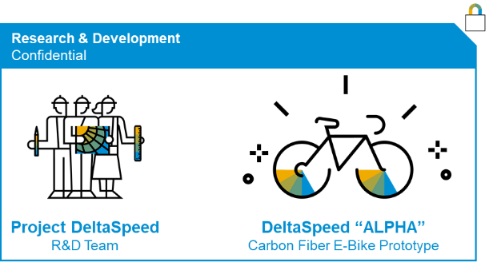
        

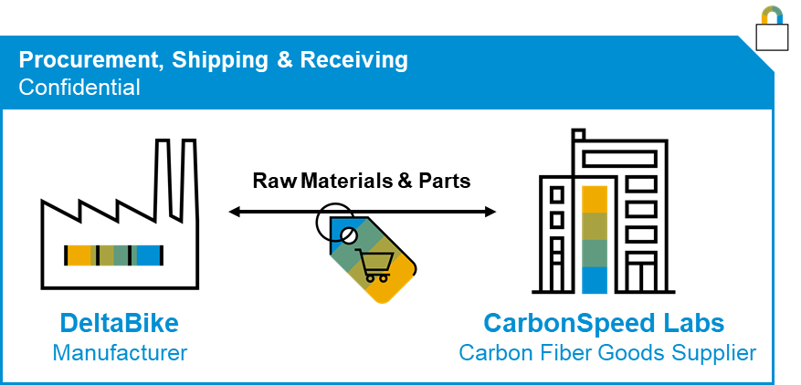
 

 

In this scenario, confidentiality of data pertaining to Project DeltaSpeed is defined on whether materials originate from the special supplier, CarbonSpeed Labs. 

 

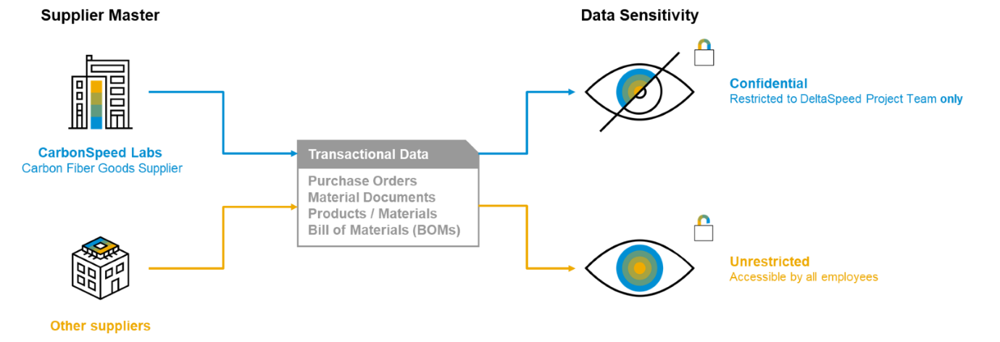
 

**Demo Scenario Overview **
This demo showcases a specific scenario involving the Procurement, Goods Receipt, Product Master and Bill of Materials process chains, including 3 users with distinct Levels of Access: 

 

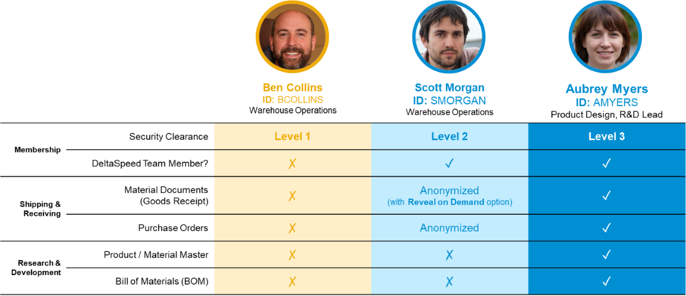
 

 

 

**Ben Collins (BCOLLINS) **

As an employee outside the DeltaSpeed Project team, Ben should not have access to display any information classified as Confidential. 

The UI Blocking feature is used to suppress data rows and block entire screens from being displayed. 

**Scott Morgan (SMORGAN) **

Despite being in the DeltaSpeed Team, as a warehouse operations specialist, Scott needs only information essential to carry out his day-to-day tasks. 

While Scott has access to display Purchase Orders and Material Documents, key information in these views is anonymized utilizing the UI Masking feature. 

In the Material Documents scenario, Scott is situationally allowed to reveal such key information through the Reveal on Demand functionality. 

Because Scott has no business use for any R&D data, access to Product Master Data and BOMs are blocked via Data Blocking feature. 

**Aubrey Myers (AMYERS) **

Aubrey is the project lead and designs the product prototypes. To this end, she is allowed to display all Confidential information without restrictions. 

In addition, Aubrey is also responsible for approving “Reveal on Demand” requests occasionally raised by Scott and his team. 

**Process Flow **
The below diagram showcases the main process flow. 

This flow intentionally excludes the Level 1 user (BCOLLINS) as this user’s role is not relevant for the process chain – given that his access is thoroughly restricted via UI Blocking. 

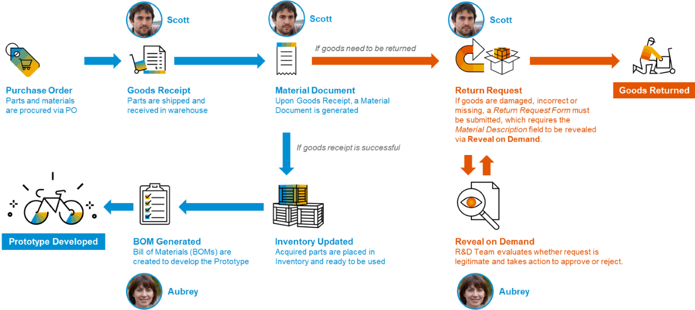
<u>Training: Time to get busy!</u>

Overview UIDP Masking Configuration

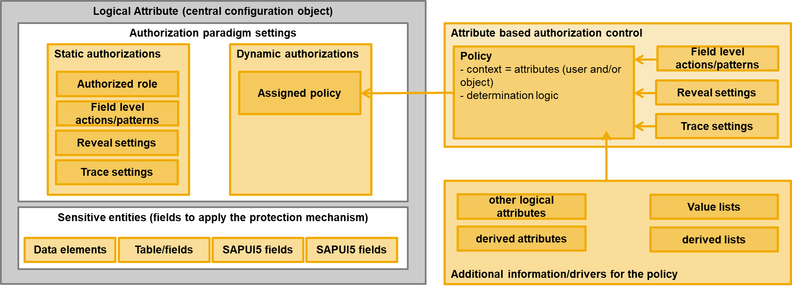
Logon to demo/hands-on systems
The training scenarios are based in separate systems per user. Please identify IP address linked to your device/seat/ID. Best note it down separately for use in the next few steps.

Access to Fiori Launchpad
The demo part and configurations are web browser based and accessible through the following link. Replace the expression [DOMAIN] (everything between “https://” and “:44301…”) manually with your terminal’s application server IP address from above).

Your browser may complain that this is not a secure connection. Please override the warnings to access the system even in unsafe mode.

Bookmark the link, or create a hyperlink e.g. on the desktop, for further use during this training.

Access to SAP GUI
The actual business scenario you will be building is based in the SAP GUI interface, which you can access through the training computer’s installation of SAP Logon. Please start SAP Logon (a local installation accessible in Windows start menu, or the icon on the desktop:

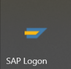
To logon, choose to create a new connection:

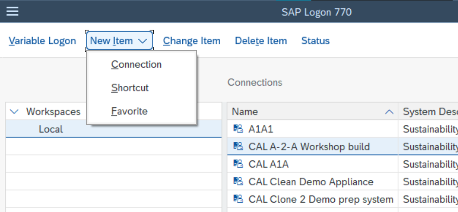
Select “user specified system” and press “Next”. In the following screen insert entries as described here and finish by “next” and “finish”:

To conduct the configurations and business scenarios, you will be using the following users and credentials. Please note that in an actual productive scenario, there should be more roles – for simplicity, we have modeled Peter Munroe, the administrator, as a super user responsible for technical and business configurations, but also with access to business information and processes.

User	Password	Name	Type
BCOLLINS	Welcome1	Ben Collins	Level 1 Clearance
SMORGAN	Welcome1	Scott Morgan	Level 2 Clearance
AMYERS	Welcome1	Aubrey Myers	Level 3 Clearance
BPINST	Welcome1	Peter Munroe	Administrator & Config user
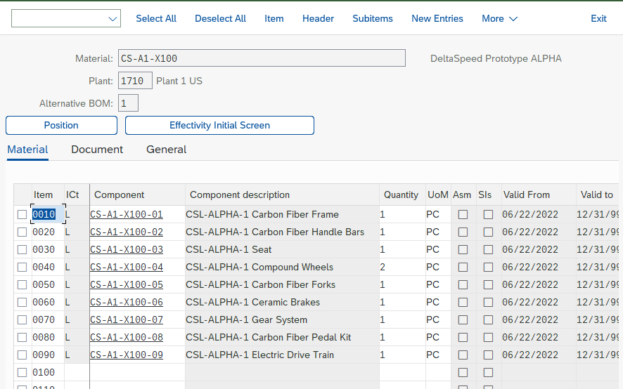
Training data for the DeltaSpeed Alpha Bill of Materials structure and all relevant material numbers (Bill of materials/BOM with header material and components:

In order to later on configure UIDP Masking, we will require technical address information for various fields – either because they are sensitive (to be protected), drive the authorization determination, or both. Let’s get them right now: In SAP Logon, open the system, log on as Administrator Peter Munroe (BPINST), go to transaction MM02, and access any of the above materials. We will require the technical information for the fields marked below.

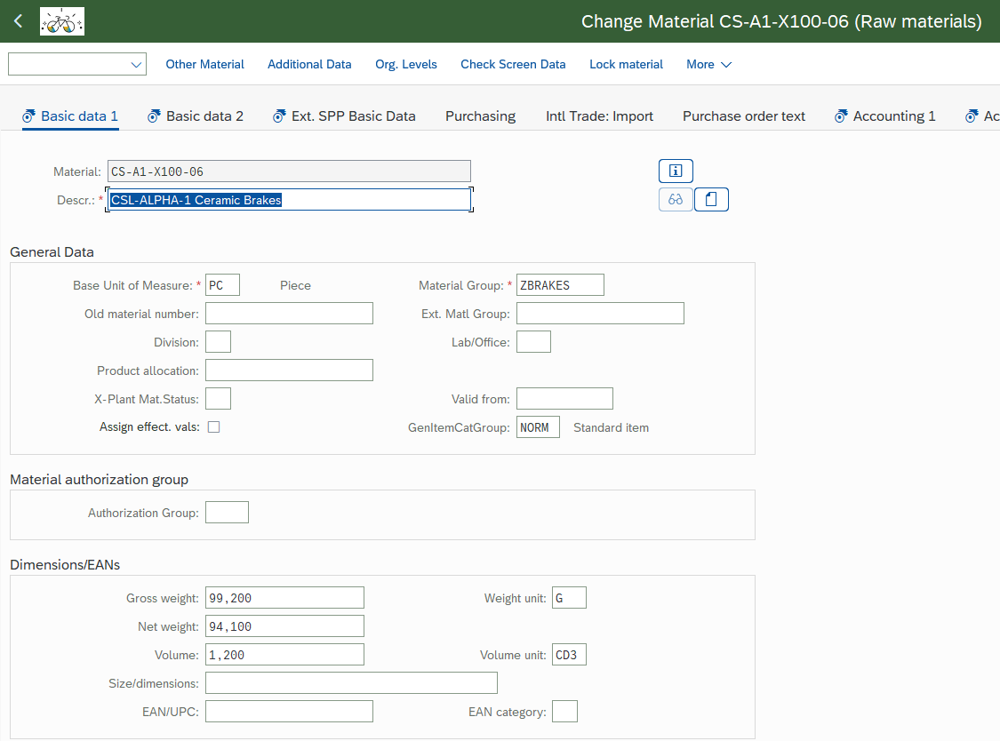
In order to determine the technical field addresses in SAP GUI, right click on the field, choose “Help”, and click on the wench tool icon for “technical information”.

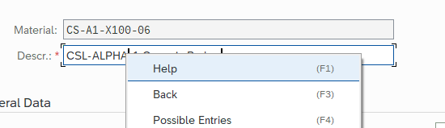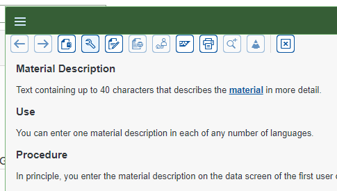
In the following screen, mark the information for data element, database table and field, as well as the Program, Dynpro screen number, and Screen field:

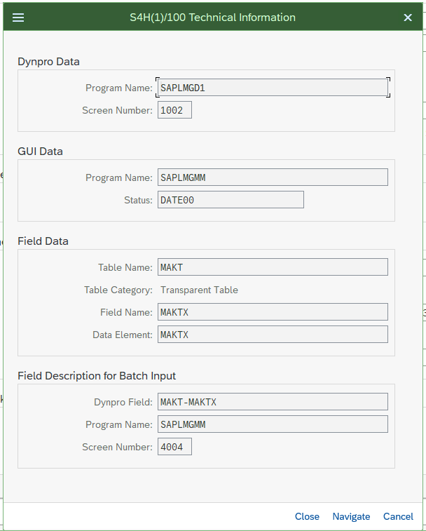
Repeat for the other fields – or cross-check with the information maintained here:

| Rank | Languages |
|-----:|-----------|
|     1| Javascript|
|     2| Python    |
|     3| SQL       |
Field	Data Element	Table Name	Field Name	Program Name	Screen Number	Screen Field
Descr |	MAKTX	MAKT	MAKTX	SAPLMGD1	1002	MAKT-MAKTX
Material [Number] |	MATNR	RMMG1	MATNR	SAPLMGD1	1002	RMMG1-MATNR
Material Group | MATKL	MARA	MATKL	SAPLMGD1	2001	MARA-MATKL
Gross Weight	BRGEW	MARA	BRGEW	SAPLMGD1	2007	MARA-BRGEW
Net Weight	NTGEW	MARA	NTGEW	SAPLMGD1	2007	MARA-NTGEW
That’s it for preparations… let’s get started with the configuration!

Optional warm-up: UI Data Protection Logging
This is not a key part of the workshop, but the UIDP Logging functionality perfectly complements the features provided by UIDP Masking –these are two sides of the same coin really. Plus, it’s really quick to set up UIDP Logging in a minimal viable fashion.

If you’re interested in the Logging feature of UI Data Protection, you may take a few minutes to start with this “bonus” scenario – if not, feel free to skip this step!

Introduction: what is UI Data Protection Logging?
In SAP S/4HANA, users are dealing with important business data, and it is critical from a security and also from a compliance standpoint that data be secured. Besides Masking, another way to secure data is to track or log it, especially if data need to be handed out in clear because a user must know. And UI data protection logging in SAP S/4HANA offers just that ability.

UI data protection logging for SAP S/4HANA logs data at the user interface. In other words, it logs all data that is presented to the user as well as entered by the user.

The data is logged at the server level and, after conversion to a standard format, logged data is stored in a temporary storage. For analysis and processing, the logged data is transferred from temporary storage to a log repository. The amount of data logged in temporary storage and in a log repository can be managed by configurating different logging depths, or using filtering.

Setup/Configuration steps (“minimal viable” scenario)
This is to set up a minimal viable scenario – UIDP Logging is a much more powerful solution and offers many more config options. But to get started it really only needs a few minutes:

Logon to the SAP GUI as Peter Munroe (user BPINST). In the “Favorites” section, you find some of the relevant UIDP Logging configuration and usage options:

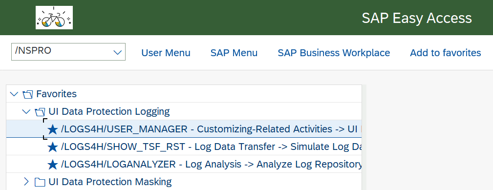
First, check the configuration in the User Manager, determining which users/roles shall be relevant for logging. Enter the first entry in the UIDP Logging favorites, or alternatively go to transaction /LOGS4H/USER_MANAGER.
The option is also found in SAP Menu through the node “Common settings” User Management “Maintain User Manager”.
In the ensuing screen, you will find in tab “Roles” that there is already a role maintained and within validity period: “ZUIDP_BUSINESSACCESS”. This role belongs to all functional users – meaning that the users are relevant for Logging and will be logged in all transactions, applications and screens which are activated for UIDP Logging.

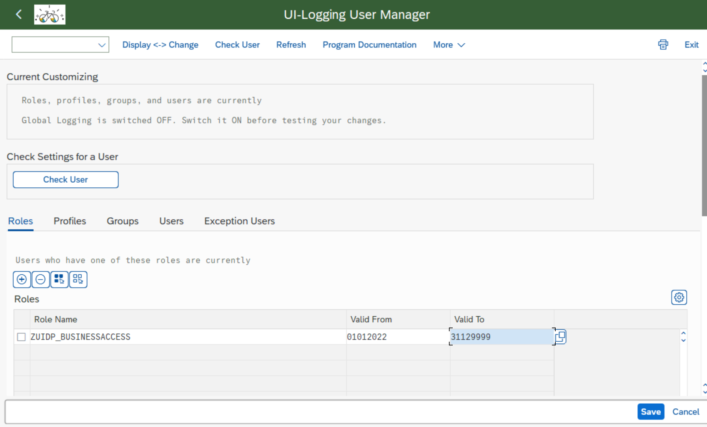
Next, you set up the baseline settings for Logging. Navigate to S/4H configuration section, transaction SPRO, and double-click the entry for UI Logging IMG View.

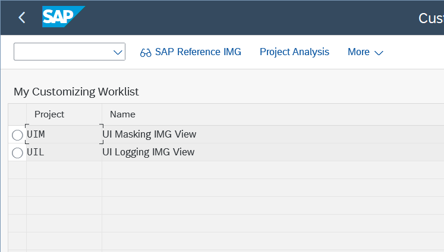
Drill into “ABAP Platform” “UI Data Protection Logging for SAP S/4HANA” “SAP GUI for Windows”. Here, click on the small “clock” character in front of the entry “Define General Parameters”:

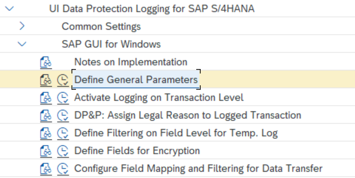
In the settings “Define General Parameters”, the baseline settings are already defined and active. For the purpose of this high level scenario, it is suggested to leave them unchanged.

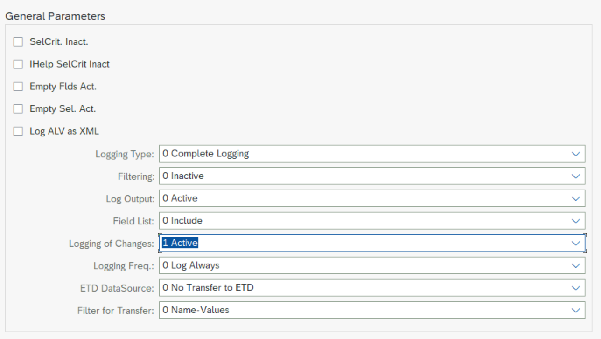
Finally, you would define which applications shall be subject to logging.
Go to node “UI data protection Logging for SAP S/4HANA” SAP GUI for Windows Activate logging on transaction level.
If not already existing, create new entries for the transactions MM02, MM03, CS02, CS03, SE16, and SE16n, and for each entry set the flag for “log active”. Leave the remaining settings on default mode (meaning they are controlled by the above general parameters). Save.

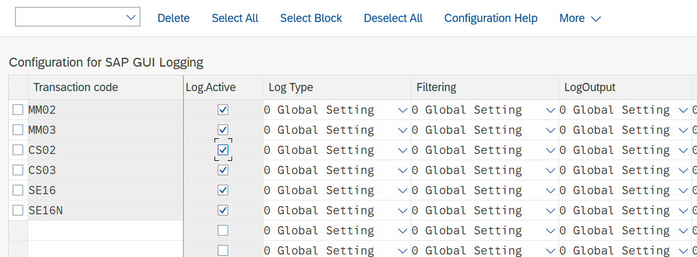
That’s it – you have a minimal viable UIDP Logging installation up and running! Every call into the server conducted by any of the three business users in the activated transactions will now result in a bespoke roundtrip log, and we will have a look at them towards the end of the training.
There are far more settings and options available, such as alerts, tagging, enrichment of log data etc., that do not however fit into this workshop.

Now, let’s move on to masking!

<u>Part 1: role based masking of fields</u>
Overview and business scenario
For the CarbonSpeed project, the key target is the radical reduction of weight of the DeltaSpeed Alpha – every gram scraped off the bike’s mass is reason to celebrate! This also means that weight information e.g. in the material master is sensitive – required to be seen by project members only.

In this section, you will configure material weight information to be considered sensitive, and assign the project members as personnel authorized to see the data – albeit with a twist so even they do not always/immediately have complete access.

Test: baseline/”vanilla” system behaviour
Log into a session of SAP GUI with user BCOLLINS.

Call transaction MM02 (Change Material), start typing a material number CS-A1 and pick any from the search help list and display details. You should see all fields in the transaction accessible and in change mode. Pay special attention to the two fields of “net weight” and gross weight” as you will be protecting and restricting access to these in the next few steps.

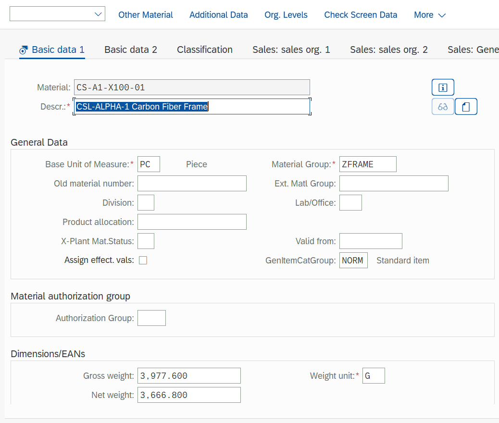
Configuration steps – simple role based scenario
Access the Fiori Launchpad and logon as Peter Munroe (BPINST).

In the Fiori Launchpad start screen, choose the tab for UIDP Masking Configuration, and then the tile for “Manage Sensitive Attributes”:

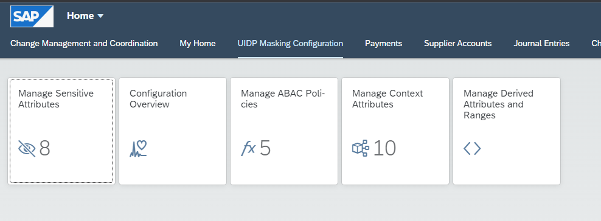
In the app screen, check that your user is assigned to a transport request (where configurations are stored so they can be transported from config clients through the system landscape into the productive clients).

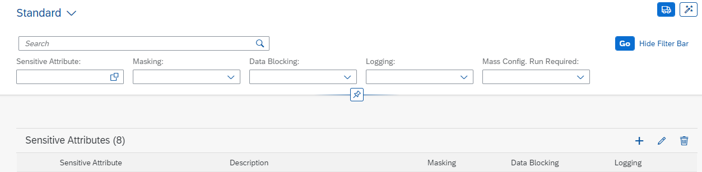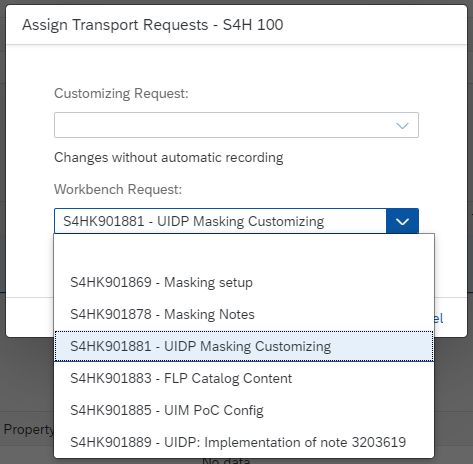
As a first step, you will define information on materials’ gross weight as sensitive.

In the “manage sensitive attributes” app, choose to create a new entry, insert name/description and press “create”.

(we suggest using the below names & descriptions; however you may choose your own ones as long as you adhere to a few naming conventions which the system will ensure).

 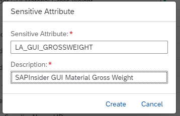
Result: you have defined a new “sensitive attribute”.

Access the details of your new attribute to fill in additional required information.

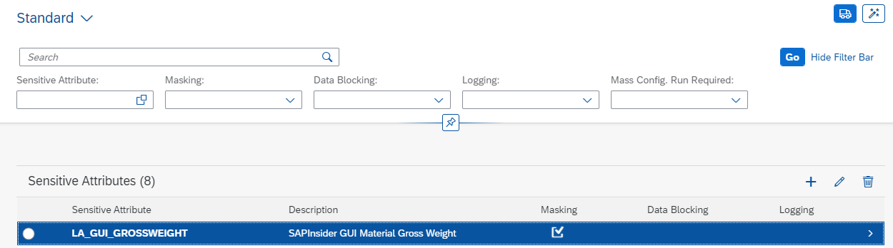
In a first step, you will create the configuration required for the system to understand which data pertain to this attribute and are to be treated by the mechanisms defined in a following step.

In the tab “Technical Mapping”, locate the section “SAP GUI (Table – Field) and add an entry with button “+”. In the mapping screen, maintain the table and field name of the gross weight you have identified earlier (here: table MARA, field name BRGEW which is an abbreviation of the German word “Bruttogewicht” meaning - surprise! - “gross weight”).

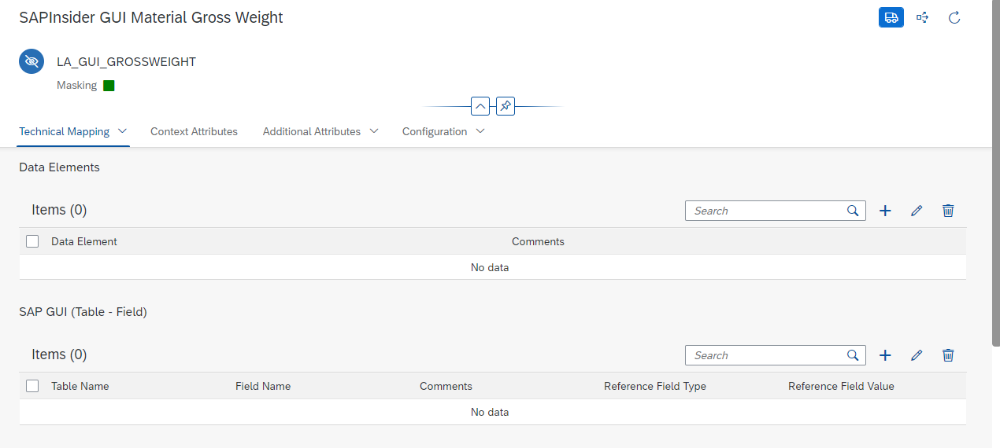 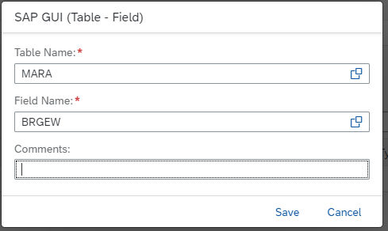
For the purpose of this training, the above entry is sufficient; in a productive scenario, you might want to put in additional definitions which are pointing to “gross weight” UI fields across the system, based on table-field definitions, data elements, and from other UIs as well.

The table-field definition is sufficient for obtaining masking in database table display transactions, e.g. SE11, SE16n… This is not yet sufficient however for business transactions, where masking is triggered by the UI field definition that you have checked out in the in the chapter on “Access to SAP GUI”. There can be literally thousands of such “SAP GUI Module Pool” entries across various transactions and modules of an SAP system!

For the benefit of understanding this key configuration entity of UIDP Masking, we will create one Module Pool entry manually first.
Scroll down the page to the section “SAP GUI (Module Pool)”. Clock “+” to add an entry, and maintain for program SAPLMGD1, Screen Number 2007, Field Name MARA-BRGEW:

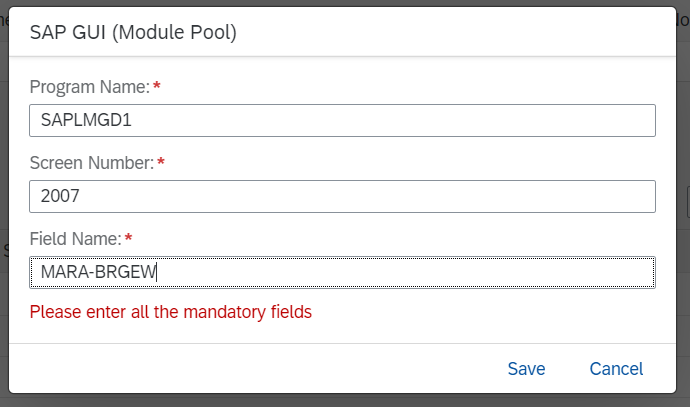
Such a manual step for adding single screen fields to the configuration may be required in normal implementations. This should be rare cases though; most entries will be added automatedly by the “mass configuration” utility. Manual entries are only necessary when this where-used functionality does not detect a screen occurrence (which you will notice during testing). Let’s look at the mass configuration utility next.

In the top right corner of the attribute definition screen, click the item for “mass configuration”. In the ensuing screen, click “execute” to trigger the automatic determination of data element, more linked table-screen definitions, and from all this, determination and configuration for UI occurrences linked to these. You can close the screen after that; or wait for a few seconds before clicking “refresh” and confirm the success message with “close”.

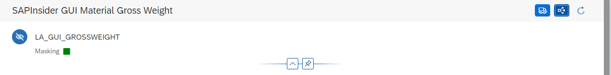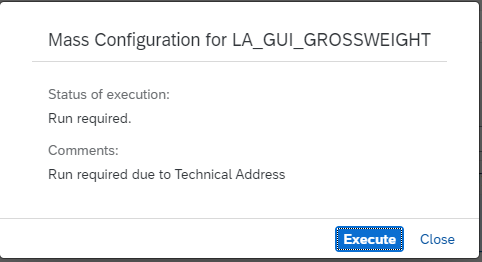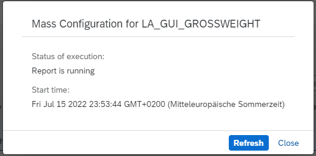 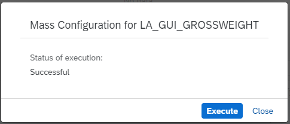
In case the system displays the moving dots/sandclock icon (picture below) for too long, reload the page from the browser (or F5 button).

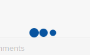
In the background, the system has identified additional table-field definitions, and if you scroll down to section “SAP GUI (Module Pool), you will also see several hundred Dynpro definitions: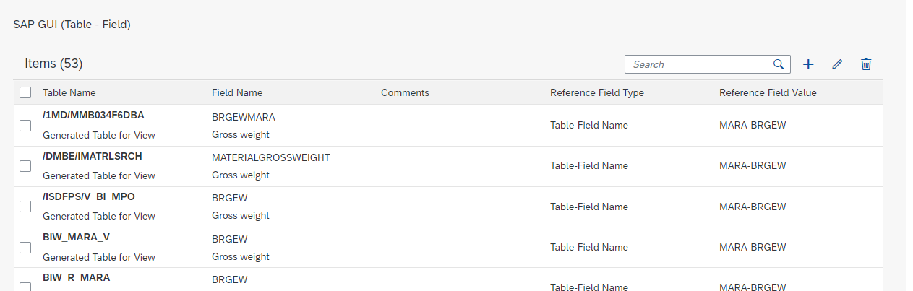

Move on to the tab “Context Attributes”. This serves to define which other attributes may be required for the authorization determination through policies. This will be required later, but not for the role based determination we are building in this part.

The same is true for tab “additional attributes”, which serves to identify additional information such as value lists or procedural determinations information required in a policy, but not available in the application proper – e.g. the manufacturer “CarbonSpeed” not always available in the documents processed in the previous demo).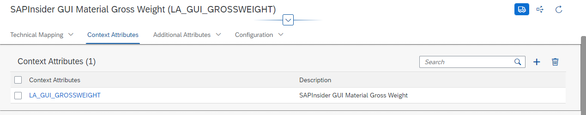

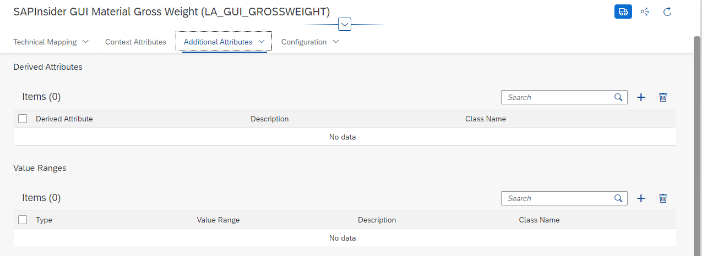
In the tab “Configuration”, we will define the authorization determination. Choose “edit”, and then “enable masking”, and “role based authorization”.

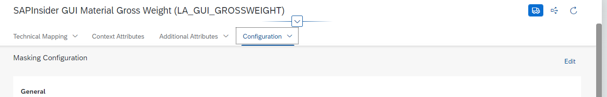
As the role (required for users to be authorized), maintain “ZUIDP_L2+3” which is mapped to the project members Scott Morgan and Aubrey Myers, but not Ben Collins.

For unauthorized users, configure that the field level action to protect the value shall be “Full Length” (or another action if you like).

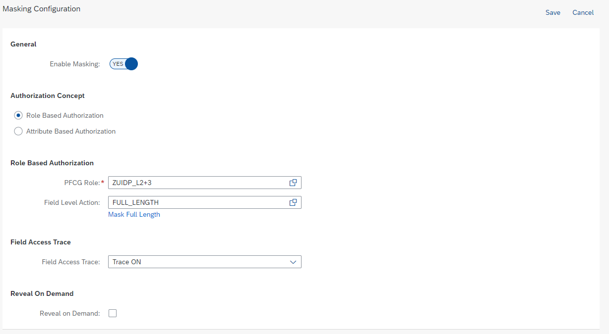
Save the entry, so the screen goes back into display mode.

With this, you’re done defining your first sensitive attribute!

Navigate one step back, to the Manage Sensitive Attributes Overview screen. Here, trigger the function in the top right corner to “Generate Program”. This will generate the necessary programs for UIDP Masking in the background. The process takes about a minute.

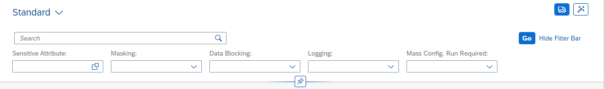
Test the settings in MM02 for user BCOLLINS who should not see the clear gross weight anymore. You may run a counter test for users SMORGAN or AMYERS who should be shown the clear value.

Configuration steps – role based with Reveal on Demand
Let’s create another, more advanced scenario first though. Consider the Net Weight as even more critical information – after all, the absolute weight of the components alone determines the core of the whole project’s value!

Navigate back to the “Manage Sensitive Attributes” Overview screen and choose to create another attribute for material net weight.

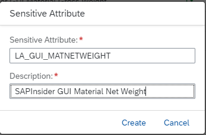
In tab “Technical Mapping”, add table-field value MARA-NTGEW. Trigger the mass configuration in the top right corner and wait for several seconds.

In the Section “SAP GUI (Module Pool), check whether the entry was created for program name SAPLMGD1; screen number 2007; field name MARA-NTGEW. If not, add this entry manually.

Again, navigate one step back, to the Manage Sensitive Attributes Overview screen. Here, trigger the function in the top right corner to “Generate Program”:

In the pop-ups, choose Execute, and then close.

<!-- -->
Move to the tab “Configurations” and maintain as in the previous case:
Enable Masking;
choose role based authorization, and as role again maintain “ZUIDP_L2+3” (mapped to the project members Scott Morgan and Aubrey Myers, but not Ben Collins).
As main difference, set the flag for “Reveal on Demand” and indicate the reveal type as “self service”. This will drive a quite different behavior for this field than in the previous case: the field will be masked in the configured manner even for authorized users Scott and Aubrey; who can however request to have the data revealed as we will see in the test section.
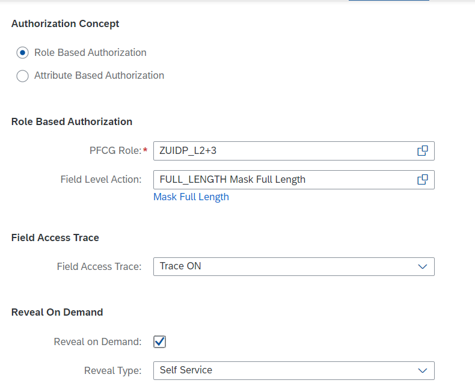
The configuration for the first scenario is now complete.

Test: protected business scenario
Log into a session of SAP GUI with user AMYERS. Call transaction MM02, start typing a material number CS-A1… and pick any of the Carbon Speed relevant materials from the search help list.
AMYERS should see the gross weight in clear, and the net weight in the way you have just configured for protection.

Now call the function “Reveal on” in the status bar “Help” menu:

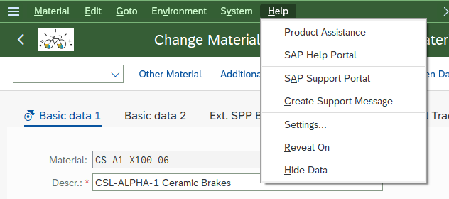
In the following screen (Step 1 of 3), select the suggested entry and press “Next”, and for step 2 “Next again”.

In the “Enter Reason (step 3 of 3), pick any reason and maintain a comment in the comment box. Press “submit”. Confirm the summary.
After screen re-load, a confirmation is displayed in the footer bar, and both weight fields should be clear and in change mode.

Log on a SAP GUI session for user BCOLLINS and repeat the above steps. You should see both the gross and net weight in protection fashion. Upon triggering “reveal on”, the process aborts as there is nothing to reveal for this user (in the latest versions a different behavior is implemented: the “reveal on” function is only displayed if there are revealable field in the screen.)

<u>Part 2: policy based masking of fields</u>
Overview and business scenario
While in the above scenario we have set up a masking of specific fields, the authorization logic really may be too simple. Yes, a non-project related employee has no access to data on critical materials. But he’s also not having access to the same data for other non-critical materials – that he may well need to know in his role! Thus, properties (attributes) of the materials actually play a role in determining their sensitivity, and who must, may, may not get access.

So let’s draw up a better approach for the next scenario right away: We now base the authorization decision not only on a role, but also determine in a policy that the masking shall be active only for materials with specific properties.

The mechanics of this scenario is that the “material group” information of a material determines whether the material is sensitive. If that is the case, then the “material description” shall be masked. At the same time, if the “material group” information belongs to the sensitive groups, the “material group” information itself shall be protected against changes by unauthorized users.

In effect, there are now two attributes which both are sensitive (material group and material description); plus a determination which values of material group are to be protected, and we will connect all three by means of authorization policies.

You will first set up the “material group” as logical attribute and create the value range for protected material groups. You will then build the simple policy for disabling the field. Afterwards, you will repeat the steps for the “material description” field and, based on the previous steps for material group, define the policy linking material group, value range, and material description.

Configuration steps
The configuration steps in this section to some extent resemble those ins section one.

In the Fiori Launchpad, as Peter Munroe (user BPINST), navigate to the “Manage Sensitive Attributes” app. Create a new attribute relevant for material group information, e.g. LA_GUI_MATGRP and save.

Access details of the logical elements. In “Technical Mappings”, create an entry in SAP GUI (Table-Field) for table MARA, field MATKL and trigger the mass configuration (as before - top right in the screen).
In this case, add a manual entry in the section SAP GUI (Module Pool) with Program name SAPLMGD1; Screen Number 2001; Screen Field MARA-MATKL (the automated “mass configuration” utility should do this in normal circumstances, but might take too long for this training).

The tab for context attributes stays empty, but in the tab for “additional attributes”, choose to add a “value range” as “List of Values” and call it “VR_SENSITIVE_MAT_GRPS” with a description you like. Click on “Create”.

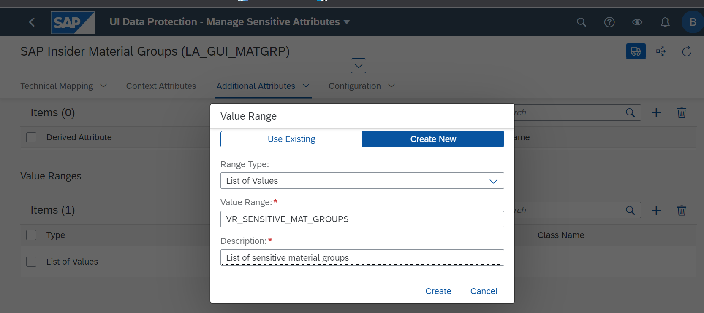
Enter the newly created value range and maintain those material groups that are to be protected. Add a new value “Z991”, which is the material group pertaining to the BOM Header material CS-A1-X100, and add a description you like.

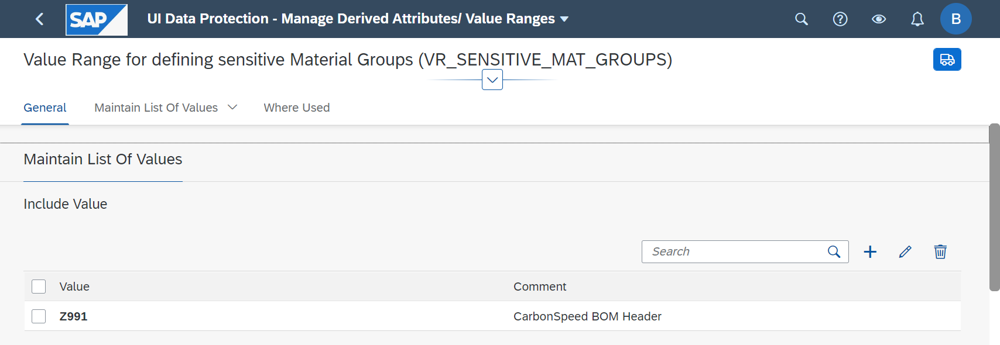
Scroll down a little, and in the section “contains pattern” add an entry “ZF*” and choose to create. This entry will pertain to materials CS-A1-X100-01 and CS-A1-X100-05, which belong to the material groups “<u>ZF</u>RAME” and “<u>ZF</u>ORK,” respectively.

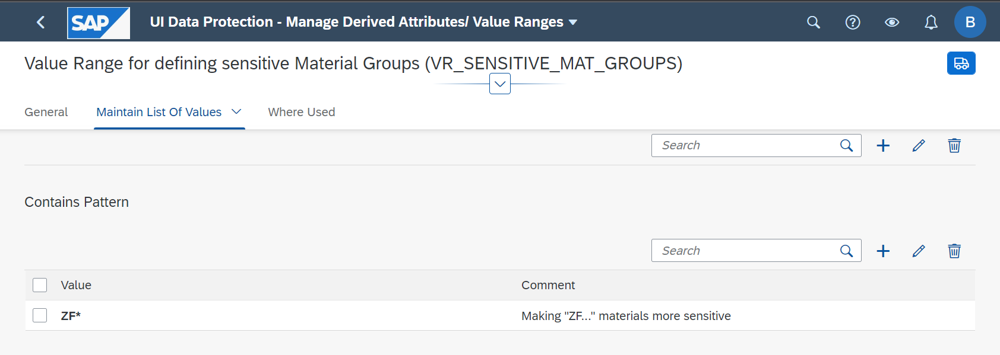
Before working on the authorization configuration, we need to do one additional step and create the technical object that is the policy (a bug in the installed version of UIDP prevents policy creation from within the Logical Attribute). To do this, navigate back to the logical attribute, back to the list of attributes, and back to the Fiori Launchpad.

In the Fiori Launchpad, click the app “Manage ABAC Policies”.

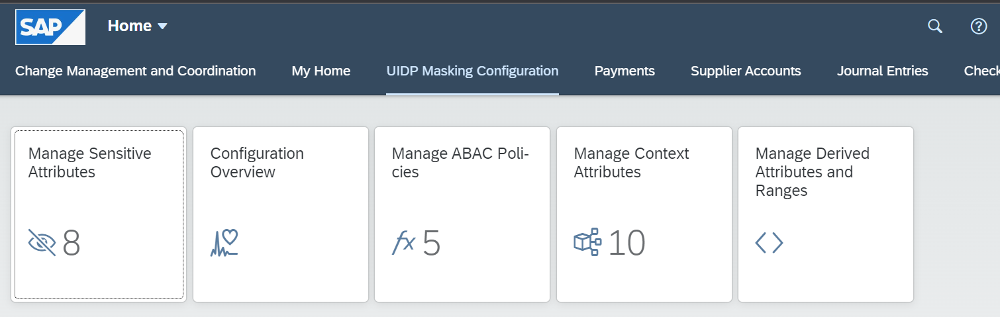
In the “Manage ABAC policies” app, you will see a few entries already existing, pertaining to the UI5/Fiori based demo scenario as indicated in the policy name, and fallback entries for the training. Choose to “add” a new policy as “masking” policy and call it e.g. POL_MSK_MTGRP_XXXXXX (replace the X characters with your own identifiers if you like). Press “create”.

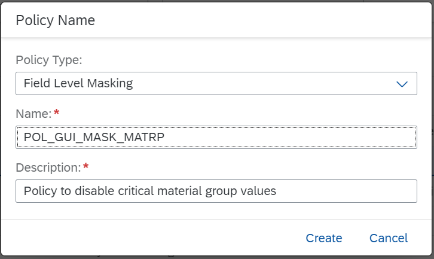
o

Navigate back to the Fiori Launchpad, open the “Manage Sensitive Attributes” app, and select the existing logical attribute LA_GUI_MATGRP. Navigate to the tab “Configuration”, where you will now set up the new policy. Choose “Edit”, then enable the masking. As authorization concept, select “Attribute Based Authorization” and assign the policy POL_MSK_MTGRP_XXXXXX you have just created.

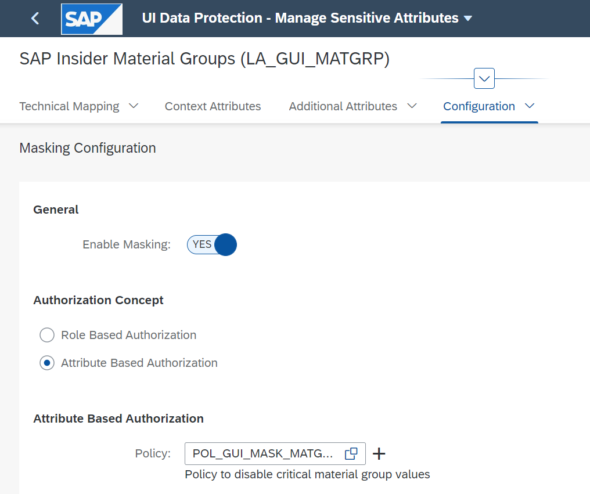
Save the settings, upon which the screen returns to display mode.

Click the name of the policy which is now a hyperlink marked blue. Scroll down to section “Rule”. Here, press “edit”, which will call the ABAC Policy Cockpit where policies can be modelled. Make sure to be in edit mode: if the menu bar shows less entries than the below screen shot, then toggle the “Display Edit” switch.

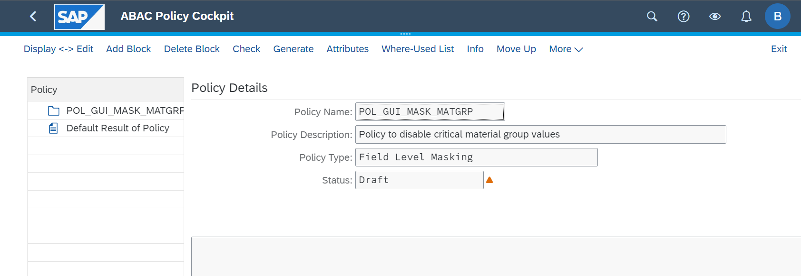
As a first step, choose to “Add Block”, give a block description and “continue”.

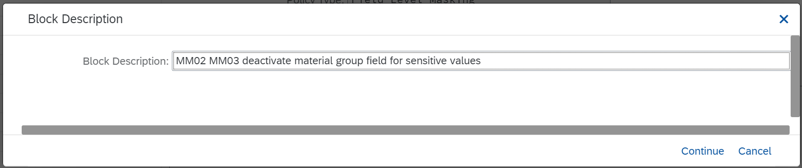
In the left hand navigation pane, expand the policy and the block.

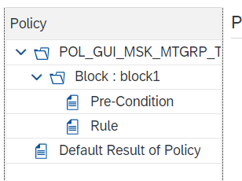
Double-click on “pre-condition”.
In this screen, you are assigning and operationally linking different attributes. In the simplest form, you are defining which attribute (“left side”) is checked for its status or relation (“operator”) to another attribute (“rights side”).

For this scenario, we are introducing a check on the transaction – the following rule shall be executed not in all cases but only in the “change” material transaction MM02.
Why? The fields and rules would equally apply to MM03 change and MM01 create transactions. However, in the “display” material transaction (MM03), the final behavior to disable the field is irrelevant. In a “create” transaction (MM01) you would certainly not want to switch the field to display only!
In the screen, in the “left side” section, double click the entry “SY-TCODE” so it appears in the upper window; then in section “operator” click on “=” and finally in operator section, click on “constant” and enter the value “MM02” (careful – the application is case sensitive for these entries).

Next, we set up the actual rule that will apply in case of an access through MM03.
First, click on “Rule” to call the actual policy definition functionality.

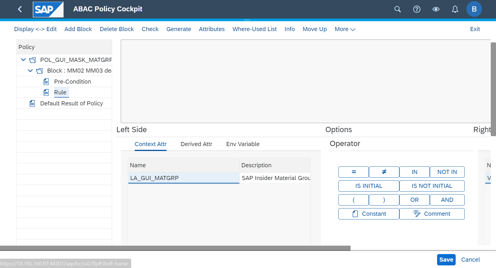
Double click on the context attribute “LA_GUI_MATGRP” so it will appear in the policy definition. Next, in the section of operators, click on button “in”, then for the right side double click on the value range you have previously created:

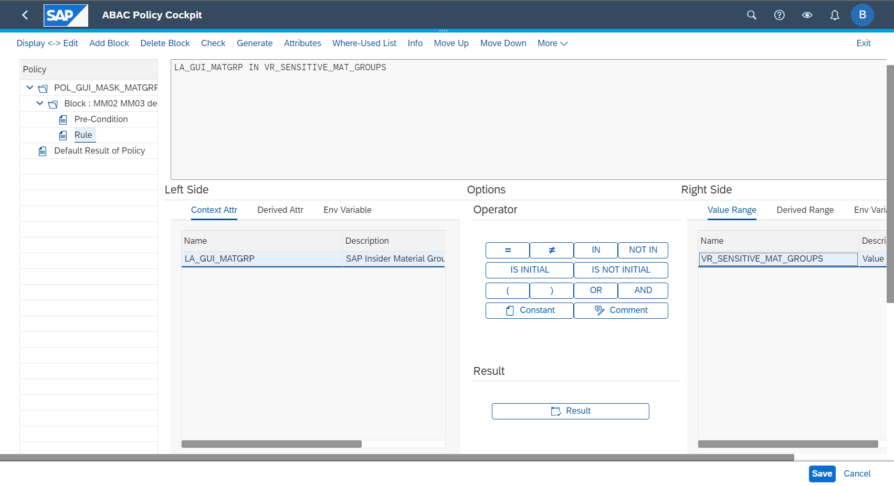
You have now set up the system to compare the value it gets for the material group to the values maintained in the value range.

Next, for the case this check is true, you will determine how the system reacts. Click on the button “result” and in the following pop-up, choose the action “disable for editing…”.
“Reveal on Demand” should remain disabled, Field access trace” is irrelevant (you will not be looking into this in the workshop). Press Enter.

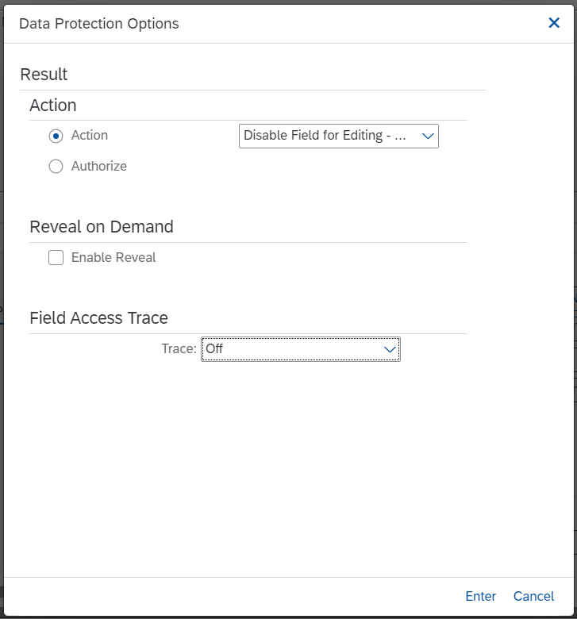
Back in the main policy definition screen, in the left hand section double-click on “Default Result of Policy” to define what happens in case all policy blocks are not meeting the pre-conditions. Here, set the action to “authorize” (i.e. the access to the requested data is granted); Reveal on Demand is greyed out (irrelevant) and Field Access Trace is again not treated in this scenario. Choose “save”.

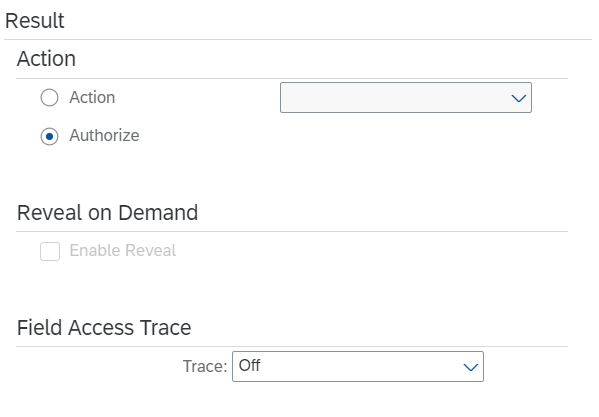
Lastly, two necessary technical steps to activate the policy.
First, in the header line, choose “check” to identify functional errors; then press “generate” and in the pop-up window accept the pre-filled workbench request and press Continue, and again on the following screen.

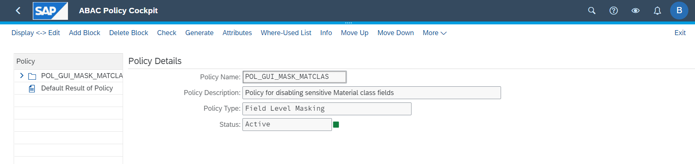
This concludes the first step of part 2 – next we’ll be setting up the protection for material descriptions fields.

If you want to run a test, do so with Aubrey Myers and ensure that even this highly authorized user sees but can’t change the material group values in MM02 for sensitive materials of the material types “ZF*” and Z991, and thus in the materials CS-A1-X100, CS-A1-X100-01, and CS-A1-X100-05.

Return to the Fiori configuration app and to the “Manage Sensitive Attributes” app. Create a new logical attribute “LA_GUI_MATDESCRIPTION”.

Navigate into details for the new attribute, and in “Technical Mapping”, maintain table MAKT and Field MAKTX. Add a manual entry in the section SAP GUI (Module Pool) with Program name SAPLMGD1; Screen Number 1002; Screen Field MAKT-MATKL.

In tab “Context Attributes”, add a new entry, choose “existing” and select the attribute for material group, “LA_GUI_MATGRP”. This makes the values of material groups available later in policy definition.

In tab “Additional attributes”, assign the value range VR_SENSITIVE_MAT_GROUPS to make them available during policy definition.

Navigate back to the Fiori Home screen and enter the app “Manage ABAC Policies”. Here, create a new policy “POL_GUI_MASK_MTDSC”.

Return to the “Manage sensitive attributes” app, enter your attribute LA_GUI_MATDESCRIPTION and go to “Configuration”. Switch to edit mode, enable masking and assign your new policy POL_GUI_MASK_MTDSC, and save.

After saving, click on the policy name/link to call policy details. In the Role section, select “edit”, and in the ensuing screen add a new block that you can call e.g. “Mask Mat Descr for unauthorized users and sensitive mat groups” and expand the policy and block.

No pre-conditions this time around – jump to the rule section immediately. Set up the rule in the following fashion:

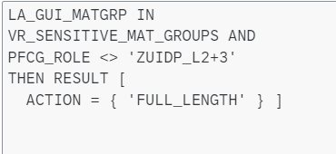
Hints:

You will find the term/attribute PFCG_ROLE in the Left Side section “Env Variable”.

The role name has been chosen as a constant to keep the scenario simple.

The action is selected by a different technical name but you’ll certainly find it.

Create a new block you could call “Allow RoD for authorized users” (all L1 non-authorized users were handled in the previous block). Again, no pre-condition is needed.

In the “Rule” section , you only activate the policy to check whether the material group is in the sensitive value range. For that case, maintain the result as “disable edit”, with Reveal on Demand being active with self service (so L2 and L3 users can get the value when they need access). Field Access Trace will not be considered, choose any value here.

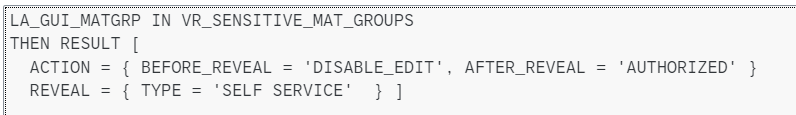
Last, maintain the “Default Result” in the fashion you’d like authorized personnel to see the material description – masked, display-only, removed; with or without Reveal on Demand option and any Field Access Trace option.

Save the policy, check for errors, and generate.

Navigate back to the “Manage Sensitive Attribute” overview/list view. Here, choose the functional button to “Generate program” and press execute to start the process.

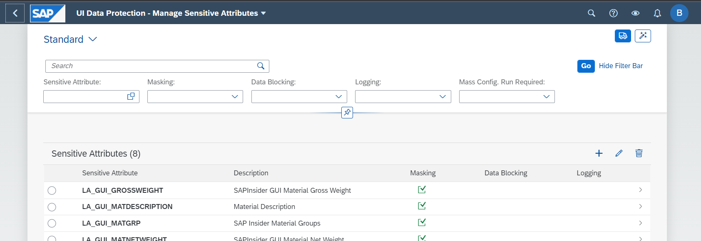
Wait for ca. half a minute before pressing “refresh” and checking that the run was successful. Then close the window.

Test: protected business scenario
Log into two SAP GUI instances with both AMYERS and BCOLLINS. You might put the two windows side by side into your screen again.

With both users, call transaction MM02, start typing a material number CS-A1 and pick any material from the list which is not sensitive, e.g. CS-A1-X100-02, -03, 04, 06, 07…. Compare the results – the fields for description and material group are identically open for both users.

Now, call two materials which are recognized as sensitive, e.g. CS-A1-X100, . CS-A1-X100-01, and CS-A1-X100-05. When comparing, you should see that both description and material group fields are masked out for BCOLLINS, where AMYERS sees the description in clear but the field is greyed out (disabled for editing).

For AMYERS, trigger the Reveal on Demand from header Helps ”Reveal On”. In the following screen, indicate which of the available fields you need to see, press next, confirm the next screen with next, and in the Enter Reason screen, indicate the reason code and a free text explanation why the RoD is needed.

You will receive a summary that access to the requested field(s) was self-approved, and then the revealed fields are displayed. Note that material group field is still masked; in a real life scenario, you might give access to a super user, or allow a reveal on demand with another responsible user required to approve a workflow to access the field.

Nevertheless – this RoD procedure is logged in the background, and visible as well with UIDP Logging.

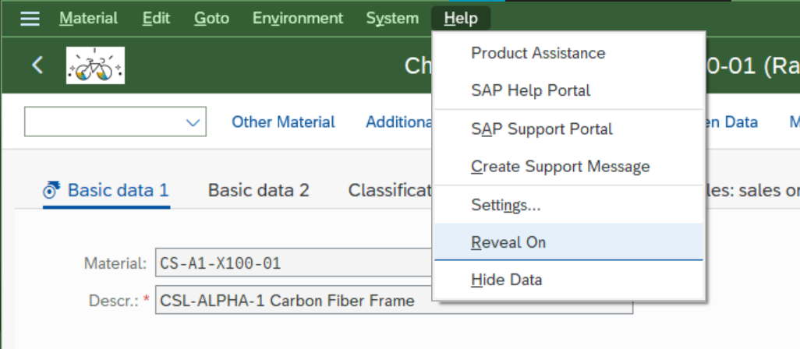
If you do the same for BCOLLINS, there is no system response as there is no field with possible reveal functionality; unless for materials of non-sensitive material groups and you’ve allowed RoD as the default result.

<u>Part 3: Policy based data blocking scenario</u>
Overview and business scenario
In a final step, we will determine that the BOM header material CS-A1-X100 is even more sensitive; and must be available only to users with highest level clearance, in this case Aubrey Myers – all other users shall be blocked from accessing the CS-A1-X100 material data.

Configuration steps
Create a new Logical Attribute called “LA_GUI_MATNR”.

In Technical Mapping, in the section SAP GUI (Module Pool), maintain two entries manually (mass configuration for this data element is not suggested in this training – it will run for 20-30mins and result in tens of thousands of table and screen field definitions! If you have already triggered, you may want to open another browser tab to continue working in the config apps.)

For the selection field in the MM02 entry screen:
Program name: SAPLMGMM; Screen Number 0060, Field Name RMMG1-MATNR

For the selection field in the CS02 BOM display transaction entry screen
Program name: SAPLCSDI; Screen Number 0100; Field Name RC29N-MATNR

In the section SAP GUI (Data Element), maintain one entry “MATNR”.

<!-- -->
Return to Fiori Launchpad, call the app to “Manage ABAC Policies” and add another new policy. Select type “data blocking,” and call it POL_GUI_BLCK_MAT or similar with any fitting description.

Return to the “Manage sensitive attributes” app and access the attribute LA_GUI_MATNR. In tab “Additional Attributes”, choose to add a new value range as “List of Values”, and call it “VR_CRITICALBOMHEADER” with a fitting description. Click on “Create”.

Double-click the new value range to access details, and include the value “CS-A1-X100” to mark the BOM header material as sensitive. (In a productive scenario, such a rule might take a more comprehensive approach, e.g. through naming conventions, or by conducting a check whether the material number is maintained in the table of BOM headers. However the manual maintenance might be a viable workaround if the above options fail.)

Return to the Logical attribute. Move to the tab “configuration”, scroll down and in the section for “Data Blocking Configuration” [not the “Masking” config!], choose “edit”. Activate “data blocking”; and assign the policy just created as POL_GUI_BLOCK_MAT.

Click “save” and then access the policy to enter the policy cockpit.

In the section “rule”, choose “edit”. In the ABAC Policy Cockpit, create a new policy block, call it “POL_GUI_BLOCK_MAT” or similar and chose a description.

Leave the segment “pre-condition” empty, and double click on the “rule” instead.
If the rule is not editable, select “Display <-> Edit” to be able to change the policy.
Maintain the rule as follows:

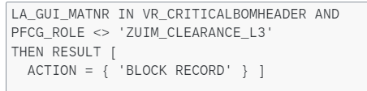
Again, the PFCG_ROLE is a “Left Side” environment variable and the ZUIM… role name maintained as a constant (careful – case sensitive).

In default result, choose to “authorize” (i.e. L3 clearance obtains the values), choose whether to save a trace, and save.

Check and generate the policy.

Return to the “Manage Sensitive Attributes” list view, hit “generate program” and check for successful status after 1-2 minutes.

Test of protected business scenario
Switch to the SAP GUI installations of AMYERS or BCOLLINS. You might put the two windows side by side into your screen again.

In MM02, enter the BOM header material code CS-A1-X100 – you will stay in the selection screen and get the warning message that the material seems to be blocked.

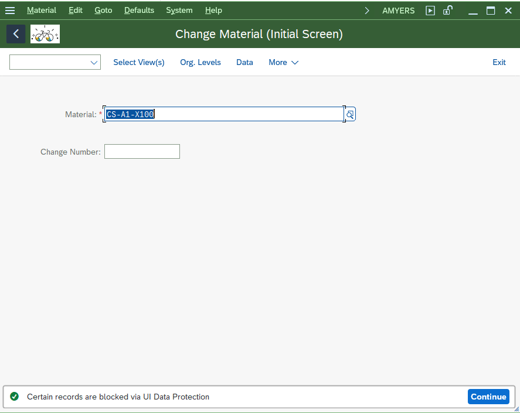
Do the same in BOM transaction CS02 for plant 1710 and usage 2.

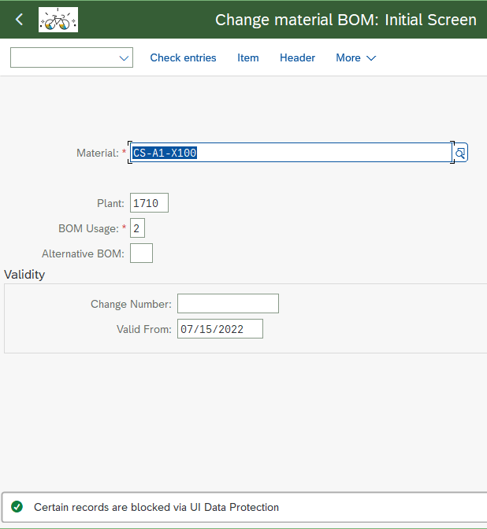
Switch to table display (SE16 or SE16n) and try to find material CS-A1-X100 in the search help and tables MARA; MAKT, and MAST. You should not be able to find these in case the configuration setup is correct; instead note the footer message that some entries are excluded:

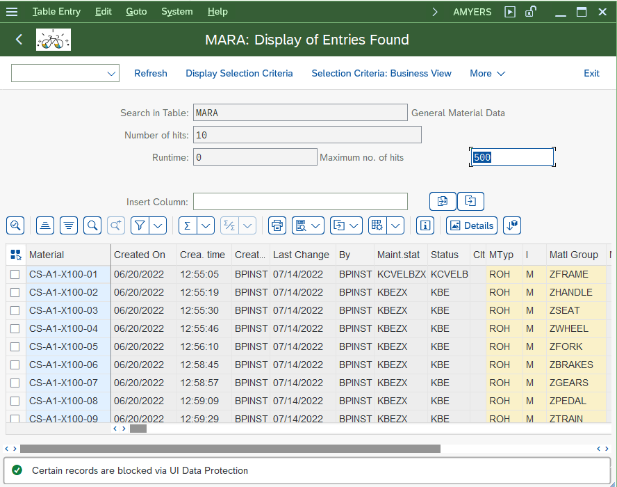
Bonus part: Multi level approach based on derived attributes in SAP GUI
If these exercises went really well for you, and you’re even done with the below testing of the UIDP Logging, you may call it a day.

If you’ve not had enough yet, and are interested in trying something on your own, why don’t you re-purpose the blocking of materials from exercise part 3 – and build it to work similarly to the UI5 demo with the level based mechanism! The attributes to identify whether the supplier of a material is critical as well as the value ranges already exist.

Just note that the critical supplier determination here is a “derived” attribute which also already exists – basically a (coded) lookup procedure, not a static value as the supplier is not available in the screen.

Don’t be ashamed to peep into the existing configurations of the UI5-relevant policies (and in a consistent setup in a productive system, it might be a choice to not build just one policy to cover both GUI and UI5 scenarios).

You can also take these home… the Fiori launchpad and a SAP GUI installation are all you need. Let your trainers know which of the appliances to activate when in the next couple days so you can finalize the training.

Reprise: Bonus Part UI Data Protection Logging
Test: protected business scenario
There would be quite a number of logs available to check already now; but for this scenario let’s create one more. As Aubrey Myers, go to MM02, call any of the non-protected materials, change one of the weight entries and save. Will you be able to identify this action later?

To have a look at the logs now, log on to SAP GUI as Admin Peter Munroe (BPINST) and call the transaction /LOGS4H/SHOW/TSF/RST (also maintained in favorites). This is actually a report reading out the data which are temporarily stored in the productive client, from where a job will move them to the more permanent repository where data aggregation and analysis is possible in an much more advanced and detailed manner:

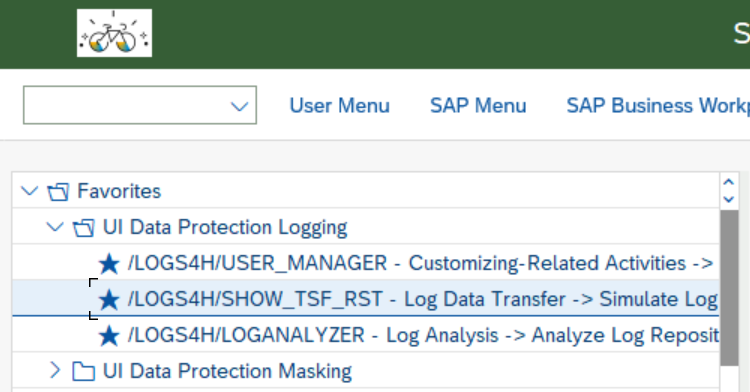
Maintain your selection parameters – or leave the default settings to show all of today’s data in your system and click on execute.

In the result screen, you see a list of all logged roundtrips on the left hand, and details per roundtrip in the right area.

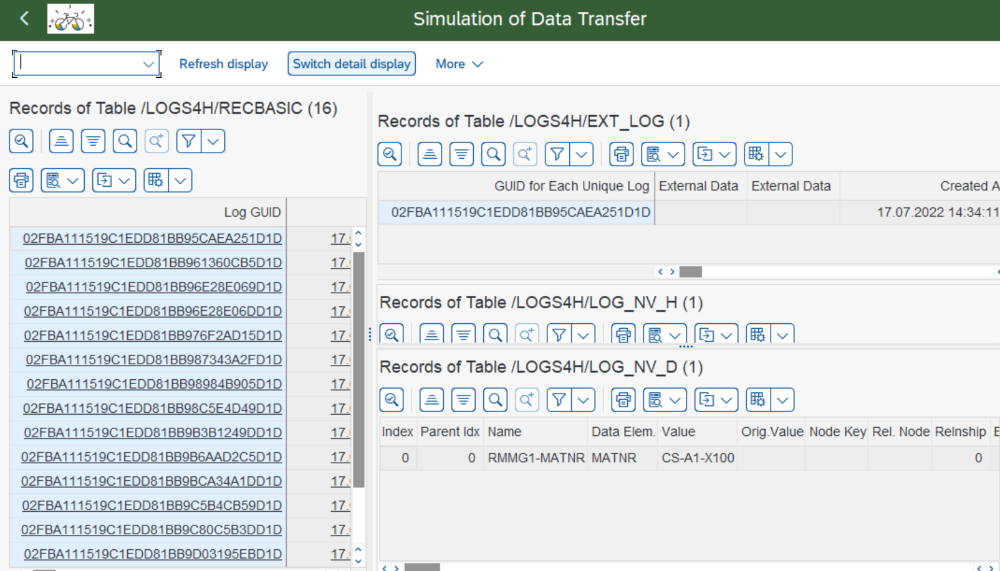
In the header, click on “Switch detail display” to get a more readable rendering of the information.

You can now go through the entries one after the other and will see the sequence and actions as well as accessed data reflected for all of the previous data accesses you have conducted with the various business users in SAP GUI.

As an attempt for reading these data:

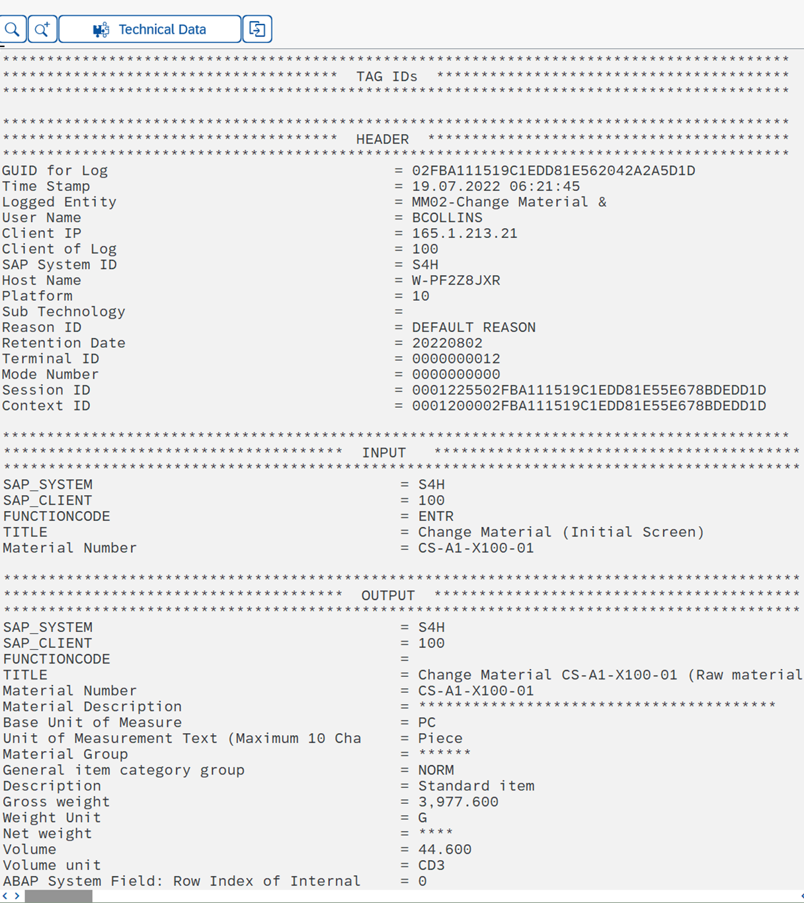
The tag ID section is empty – we had not configured any tags, which would be a way of making search-relevant context more prominent, or to even add context not available in the field proper (e.g. the supplier in a material master change scenario).

The header section contains metadata helping to identify the user (user ID, IP, host/computer name…) and how he accessed the data (system, UI technology, transaction/application name). There’s also metadata for data protection requirements, such as reason code and retention date (after which the record can be removed)

The “Input” section contains selection parameters and action IDs, if appropriate. Here, the access (selection criteria) was to material CS-A1-X100-01. There’s not always a specific input/selection value; in particular if there was a navigation within one app, this section is often empty and the output is basically the continuation of the previous roundtrip.

The “Output” sections contains a list of all fields included in the system response. Also here, you will not always have data: there are cases e.g. of a screen break after the input – but then the following roundtrip/record will be carrying these.

This is certainly a lot to take in – please consider that these are raw data however, and in many cases analysing users will not need these; plus, there are options to decrease the data volumes while keeping the entirety of all actions (roundtrips) intact.

Finally, scroll to the end of the list of roundtrips with the latest time stamps. Go through the last few entries, and try to identify the instance where you have changed the material weight. Will you see it? Hint: keep looking at the input section for an entry for weight… that’s the clue to look for! There are also reports in the solution to highlight such changes, but they are based in the repository.
Thank you for spending your time with us today – and looking forward to
being in touch!
